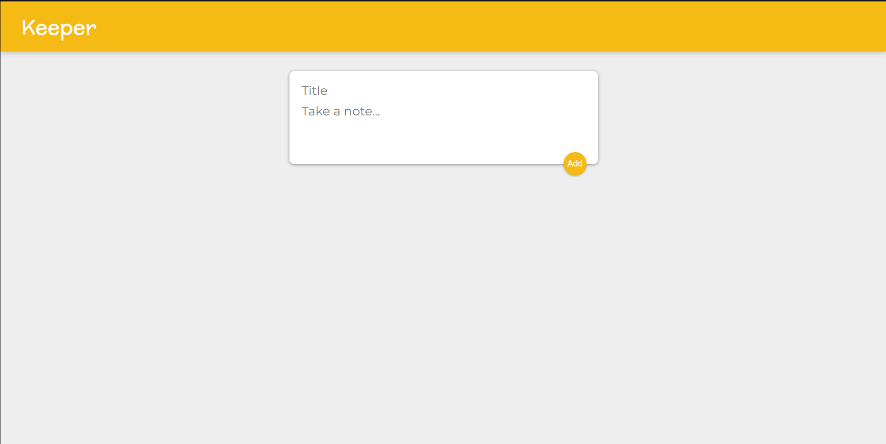
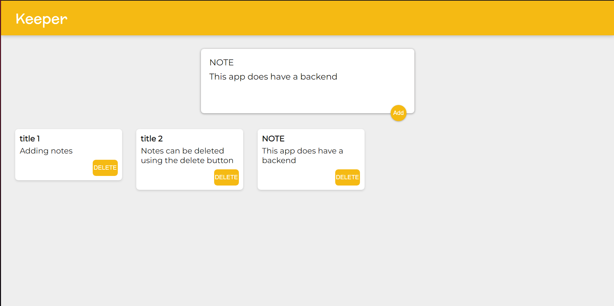

# Keeper-App
This is a simple note making app that I created using React.js as part of a course.  

  

  

Running Guide:  
Install Node.js  
Clone this repository.  
Enter the below commands on terminal  
```
npm install
```  
```
npm start
```  
localhost:3000 should open on your browser.  


NOTE:  
This project does have any backend so all notes added will be gone after refreshing.  

This project can be improved by adding backend.
